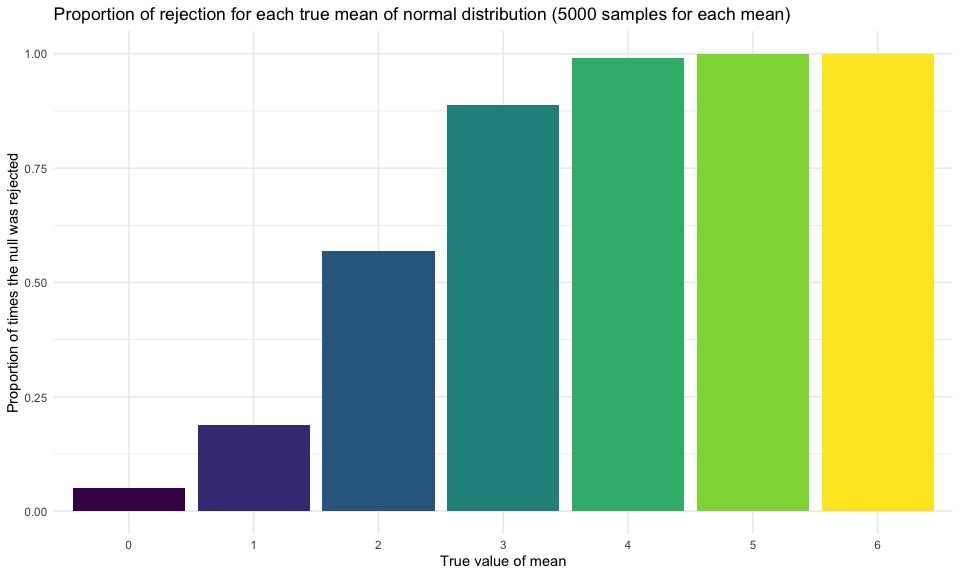
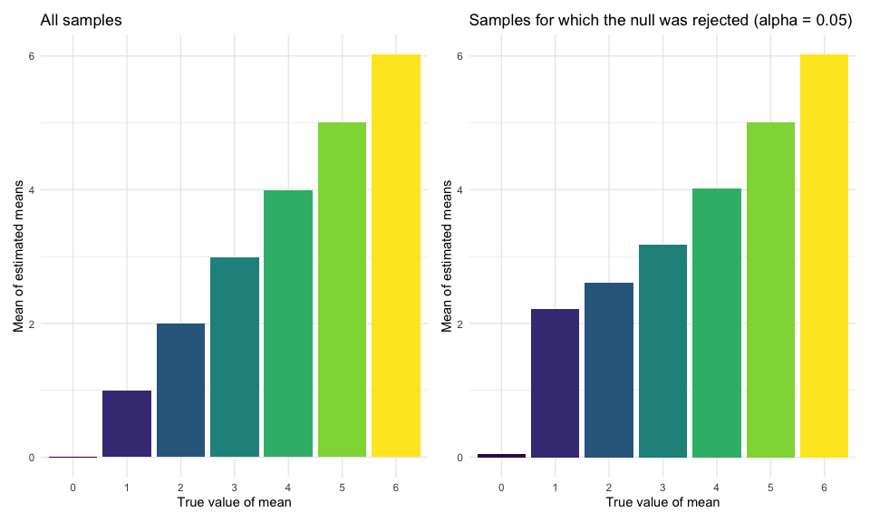

HW5
================
Yi Sun

Solution to HW5.

## Problem 1

Load the homicide data.

``` r
homicide_raw = read_csv("./homicide-data.csv")
```

    ## Parsed with column specification:
    ## cols(
    ##   uid = col_character(),
    ##   reported_date = col_double(),
    ##   victim_last = col_character(),
    ##   victim_first = col_character(),
    ##   victim_race = col_character(),
    ##   victim_age = col_character(),
    ##   victim_sex = col_character(),
    ##   city = col_character(),
    ##   state = col_character(),
    ##   lat = col_double(),
    ##   lon = col_double(),
    ##   disposition = col_character()
    ## )

There are 52179 observations and 12 variables in the raw data. The data
included the location of the killing, whether an arrest was made and, in
most cases, basic demographic information about each victim. Each
observation is a record of a criminal homicide in the past decade in 50
of the largest American cities.

Create `city_state` and `resolved` variables and keep them only in the
resulting dataframe. Drop the data for Tulsa, AL, because there is only
1 homicide record from this city.

``` r
homicide_df = 
  homicide_raw %>% 
  mutate(
    city_state = str_c(city, state, sep = ", "),
    resolved = case_when(
      disposition == "Closed without arrest" ~ "unsolved",
      disposition == "Open/No arrest"        ~ "unsolved",
      disposition == "Closed by arrest"      ~ "solved",
    )
  ) %>% 
  select(city_state, resolved) %>% 
  filter(city_state != "Tulsa, AL")
```

Summarize within cities to obtain the total number of homicides and the
number of unsolved homicides.

``` r
aggregate_df = 
  homicide_df %>% 
  group_by(city_state) %>% 
  summarize(
    hom_total = n(),
    hom_unsolved = sum(resolved == "unsolved")
  )
```

    ## `summarise()` ungrouping output (override with `.groups` argument)

For the city of Baltimore, MD, use the `prop.test` function to estimate
the proportion of homicides that are unsolved, save the output as an R
object, apply `broom::tidy` to this object, and pull the estimated
proportion and confidence intervals from the resulting tidy dataframe.

``` r
bal_results_df = 
  prop.test(
    aggregate_df %>% filter(city_state == "Baltimore, MD") %>% pull(hom_unsolved), 
    aggregate_df %>% filter(city_state == "Baltimore, MD") %>% pull(hom_total)
  ) %>% 
  broom::tidy() %>% 
  select(estimate, conf.low, conf.high)
```

Now run `prop.test` for each of the cities in `aggregate_df`, and
extract both the proportion of unsolved homicides and the confidence
interval for each. Do this within a “tidy” pipeline, making use of
`purrr::map`, `purrr::map2`, list columns and `unnest` as necessary to
create a tidy dataframe with estimated proportions and CIs for each
city.

``` r
results_df = 
  aggregate_df %>% 
  mutate(
    prop_tests = map2(.x = hom_unsolved, .y = hom_total, ~prop.test(x = .x, n = .y)),
    tidy_tests = map(.x = prop_tests, ~broom::tidy(.x))
  ) %>% 
  select(-prop_tests) %>% 
  unnest(tidy_tests) %>% 
  select(city_state, estimate, conf.low, conf.high)
```

Create a plot that shows the estimates and CIs for each city, using
`geom_errorbar` to add error bars based on the upper and lower limits.
Organize cities according to the proportion of unsolved homicides.

``` r
dist_hom_city = 
  results_df %>% 
  mutate(city_state = fct_reorder(city_state, estimate)) %>% 
  ggplot(aes(x = city_state, y = estimate)) +
  geom_point() + 
  geom_errorbar(aes(ymin = conf.low, ymax = conf.high)) + 
  theme(axis.text.x = element_text(angle = 90, vjust = 0.5, hjust = 1)) +
  labs(
    x = "City",
    y = "Proportion of unsolved homicides",
    title = "Estimated proportions of unsolved homicides with 95% CIs for cities"
  )

dist_hom_city
```


## Problem 2

Create a tidy dataframe containing data from all participants, including
the subject ID, arm, and observations over time.

``` r
longitudinal_df = 
  tibble(file_name = list.files(path = "./data", full.names = TRUE)) %>% 
  mutate(df = map(.x = file_name, ~read_csv(.x))) %>% 
  unnest(df) %>% 
  pivot_longer(
    week_1:week_8,
    names_to = "week",
    names_prefix = "week_",
    values_to = "observation"
  ) %>% 
  mutate(
    arm = substring(file_name, 8, 10),
    id = as.numeric(substring(file_name, 12, 13)),
    arm = str_replace(arm, "con", "control"),
    arm = str_replace(arm, "exp", "experiment")
  ) %>% 
  select(-file_name) %>% 
  relocate(arm, id)
```

    ## Parsed with column specification:
    ## cols(
    ##   week_1 = col_double(),
    ##   week_2 = col_double(),
    ##   week_3 = col_double(),
    ##   week_4 = col_double(),
    ##   week_5 = col_double(),
    ##   week_6 = col_double(),
    ##   week_7 = col_double(),
    ##   week_8 = col_double()
    ## )
    ## Parsed with column specification:
    ## cols(
    ##   week_1 = col_double(),
    ##   week_2 = col_double(),
    ##   week_3 = col_double(),
    ##   week_4 = col_double(),
    ##   week_5 = col_double(),
    ##   week_6 = col_double(),
    ##   week_7 = col_double(),
    ##   week_8 = col_double()
    ## )
    ## Parsed with column specification:
    ## cols(
    ##   week_1 = col_double(),
    ##   week_2 = col_double(),
    ##   week_3 = col_double(),
    ##   week_4 = col_double(),
    ##   week_5 = col_double(),
    ##   week_6 = col_double(),
    ##   week_7 = col_double(),
    ##   week_8 = col_double()
    ## )
    ## Parsed with column specification:
    ## cols(
    ##   week_1 = col_double(),
    ##   week_2 = col_double(),
    ##   week_3 = col_double(),
    ##   week_4 = col_double(),
    ##   week_5 = col_double(),
    ##   week_6 = col_double(),
    ##   week_7 = col_double(),
    ##   week_8 = col_double()
    ## )
    ## Parsed with column specification:
    ## cols(
    ##   week_1 = col_double(),
    ##   week_2 = col_double(),
    ##   week_3 = col_double(),
    ##   week_4 = col_double(),
    ##   week_5 = col_double(),
    ##   week_6 = col_double(),
    ##   week_7 = col_double(),
    ##   week_8 = col_double()
    ## )
    ## Parsed with column specification:
    ## cols(
    ##   week_1 = col_double(),
    ##   week_2 = col_double(),
    ##   week_3 = col_double(),
    ##   week_4 = col_double(),
    ##   week_5 = col_double(),
    ##   week_6 = col_double(),
    ##   week_7 = col_double(),
    ##   week_8 = col_double()
    ## )
    ## Parsed with column specification:
    ## cols(
    ##   week_1 = col_double(),
    ##   week_2 = col_double(),
    ##   week_3 = col_double(),
    ##   week_4 = col_double(),
    ##   week_5 = col_double(),
    ##   week_6 = col_double(),
    ##   week_7 = col_double(),
    ##   week_8 = col_double()
    ## )
    ## Parsed with column specification:
    ## cols(
    ##   week_1 = col_double(),
    ##   week_2 = col_double(),
    ##   week_3 = col_double(),
    ##   week_4 = col_double(),
    ##   week_5 = col_double(),
    ##   week_6 = col_double(),
    ##   week_7 = col_double(),
    ##   week_8 = col_double()
    ## )
    ## Parsed with column specification:
    ## cols(
    ##   week_1 = col_double(),
    ##   week_2 = col_double(),
    ##   week_3 = col_double(),
    ##   week_4 = col_double(),
    ##   week_5 = col_double(),
    ##   week_6 = col_double(),
    ##   week_7 = col_double(),
    ##   week_8 = col_double()
    ## )
    ## Parsed with column specification:
    ## cols(
    ##   week_1 = col_double(),
    ##   week_2 = col_double(),
    ##   week_3 = col_double(),
    ##   week_4 = col_double(),
    ##   week_5 = col_double(),
    ##   week_6 = col_double(),
    ##   week_7 = col_double(),
    ##   week_8 = col_double()
    ## )
    ## Parsed with column specification:
    ## cols(
    ##   week_1 = col_double(),
    ##   week_2 = col_double(),
    ##   week_3 = col_double(),
    ##   week_4 = col_double(),
    ##   week_5 = col_double(),
    ##   week_6 = col_double(),
    ##   week_7 = col_double(),
    ##   week_8 = col_double()
    ## )
    ## Parsed with column specification:
    ## cols(
    ##   week_1 = col_double(),
    ##   week_2 = col_double(),
    ##   week_3 = col_double(),
    ##   week_4 = col_double(),
    ##   week_5 = col_double(),
    ##   week_6 = col_double(),
    ##   week_7 = col_double(),
    ##   week_8 = col_double()
    ## )
    ## Parsed with column specification:
    ## cols(
    ##   week_1 = col_double(),
    ##   week_2 = col_double(),
    ##   week_3 = col_double(),
    ##   week_4 = col_double(),
    ##   week_5 = col_double(),
    ##   week_6 = col_double(),
    ##   week_7 = col_double(),
    ##   week_8 = col_double()
    ## )
    ## Parsed with column specification:
    ## cols(
    ##   week_1 = col_double(),
    ##   week_2 = col_double(),
    ##   week_3 = col_double(),
    ##   week_4 = col_double(),
    ##   week_5 = col_double(),
    ##   week_6 = col_double(),
    ##   week_7 = col_double(),
    ##   week_8 = col_double()
    ## )
    ## Parsed with column specification:
    ## cols(
    ##   week_1 = col_double(),
    ##   week_2 = col_double(),
    ##   week_3 = col_double(),
    ##   week_4 = col_double(),
    ##   week_5 = col_double(),
    ##   week_6 = col_double(),
    ##   week_7 = col_double(),
    ##   week_8 = col_double()
    ## )
    ## Parsed with column specification:
    ## cols(
    ##   week_1 = col_double(),
    ##   week_2 = col_double(),
    ##   week_3 = col_double(),
    ##   week_4 = col_double(),
    ##   week_5 = col_double(),
    ##   week_6 = col_double(),
    ##   week_7 = col_double(),
    ##   week_8 = col_double()
    ## )
    ## Parsed with column specification:
    ## cols(
    ##   week_1 = col_double(),
    ##   week_2 = col_double(),
    ##   week_3 = col_double(),
    ##   week_4 = col_double(),
    ##   week_5 = col_double(),
    ##   week_6 = col_double(),
    ##   week_7 = col_double(),
    ##   week_8 = col_double()
    ## )
    ## Parsed with column specification:
    ## cols(
    ##   week_1 = col_double(),
    ##   week_2 = col_double(),
    ##   week_3 = col_double(),
    ##   week_4 = col_double(),
    ##   week_5 = col_double(),
    ##   week_6 = col_double(),
    ##   week_7 = col_double(),
    ##   week_8 = col_double()
    ## )
    ## Parsed with column specification:
    ## cols(
    ##   week_1 = col_double(),
    ##   week_2 = col_double(),
    ##   week_3 = col_double(),
    ##   week_4 = col_double(),
    ##   week_5 = col_double(),
    ##   week_6 = col_double(),
    ##   week_7 = col_double(),
    ##   week_8 = col_double()
    ## )
    ## Parsed with column specification:
    ## cols(
    ##   week_1 = col_double(),
    ##   week_2 = col_double(),
    ##   week_3 = col_double(),
    ##   week_4 = col_double(),
    ##   week_5 = col_double(),
    ##   week_6 = col_double(),
    ##   week_7 = col_double(),
    ##   week_8 = col_double()
    ## )

Make a spaghetti plot showing observations on each subject over time,
and comment on differences between groups.

``` r
spaghetti_plot = 
  longitudinal_df %>% 
  ggplot(aes(x = week, y = observation, group = interaction(arm, id), color = arm)) + 
    geom_line() + 
    labs(
      x = "Week",
      y = "Observation",
      title = "Observations for subjects in experiment and control groups for each week"
    )

spaghetti_plot
```


In general, the observations of the experiment group continued to rise,
while the observations of the control group were comparatively stable
over time. The difference in observations between the experiment group
and the control group was not apparent at early time points (week 1 or
2) but became greater over time.

## Problem 3

Set a seed for reproducibility.

``` r
set.seed(1)
```

Write a function to simulate data with sample size n = 30 from a normal
distribution with sd = 5, and return estimates of the mean and standard
deviation.

``` r
sim_norm_sample = function(n = 30, mu, sigma = 5) {
  tibble(
    x = rnorm(n, mean = mu, sd = sigma)
  )
}
```

Generate 5000 datasets using the function above with mean of normal
distribution = 0.

``` r
sim_samples_zero = 
  tibble(
    samp = rerun(5000, sim_norm_sample(mu = 0))
  )
```

For each dataset, save mu\_hat and the p-value arising from a test of H:
mu = 0 using alpha = 0.05.

``` r
ttest_zero_df = 
  sim_samples_zero %>% 
  mutate(
    t_tests = map(.x = samp, ~t.test(x = .x, mu = 0)),
    tidy_tests = map(.x = t_tests, ~broom::tidy(.x))
  ) %>% 
  select(-t_tests) %>% 
  unnest(tidy_tests) %>% 
  select(estimate, p.value) %>% 
  rename(c("mu_hat" = "estimate", "p_value" = "p.value"))
```

Repeat the above for normal distribution with mean from 1 to 6.

``` r
ttest_df = 
  tibble(norm_mean = 1:6) %>% 
  mutate(
    samp = map(.x = norm_mean, ~rerun(5000, sim_norm_sample(mu = .x))),
  ) %>% 
  unnest(samp) %>% 
  mutate(
    t_tests = map(.x = samp, ~t.test(x = .x, mu = 0)),
    tidy_tests = map(.x = t_tests, ~broom::tidy(.x))
  ) %>% 
  select(-t_tests) %>% 
  unnest(tidy_tests) %>% 
  select(norm_mean, estimate, p.value) %>% 
  rename(c("mu_hat" = "estimate", "p_value" = "p.value"))
```

Make a plot showing the proportion of times the null was rejected (the
power of the test) on the y axis and the true value of mean on the x
axis.

``` r
rej_mean_plot = 
  ttest_df %>% 
  mutate(
    conclusion = if_else(p_value < 0.05, "reject", "fail to reject"),
    norm_mean = as.factor(norm_mean)
  ) %>% 
  group_by(norm_mean) %>% 
  summarize(
    test_total = n(),
    test_rej = sum(conclusion == "reject")
  ) %>% 
  mutate(
    rej_prop = test_rej / test_total
  ) %>% 
  ggplot(aes(x = norm_mean, y = rej_prop, fill = norm_mean)) +
    geom_col() +
    theme(legend.position = "none") +
    labs(
      x = "True value of mean",
      y = "Proportion of times the null was rejected",
      title = "Proportion of rejection by true mean of normal distribution (5000 samples for each mean)"
    )
```

    ## `summarise()` ungrouping output (override with `.groups` argument)

``` r
rej_mean_plot
```



From the plot, we can see that the power goes up as the effect size goes
up.

Make a plot showing the average estimate of `mu_hat` on the y axis and
the true value of mean on the x axis.  
Make a second plot showing the average estimate of `mu_hat` only in
samples for which the null was rejected on the y axis and the true value
of mean on the x axis.

``` r
mu_hat_mean_plot = 
  ttest_df %>% 
  mutate(norm_mean = as.factor(norm_mean)) %>% 
  group_by(norm_mean) %>% 
  summarize(mu_hat_mean = mean(mu_hat)) %>% 
  ggplot() +
    geom_col(mapping = aes(x = norm_mean, y = mu_hat_mean, fill = norm_mean)) +
    theme(legend.position = "none") +
    labs(
      x = "True value of mean",
      y = "Mean of estimated means",
      title = "All samples"
    )
```

    ## `summarise()` ungrouping output (override with `.groups` argument)

``` r
mu_hat_mean_sig_plot = 
  ttest_df %>% 
  mutate(norm_mean = as.factor(norm_mean)) %>% 
  filter(p_value < 0.05) %>% 
  group_by(norm_mean) %>% 
  summarize(mu_hat_mean = mean(mu_hat)) %>% 
  ggplot() +
    geom_col(mapping = aes(x = norm_mean, y = mu_hat_mean, fill = norm_mean)) +
    theme(legend.position = "none") +
    labs(
      x = "True value of mean",
      y = "Mean of estimated means",
      title = "Samples for which the null was rejected (alpha = 0.05)"
    )
```

    ## `summarise()` ungrouping output (override with `.groups` argument)

``` r
mu_hat_mean_plot + mu_hat_mean_sig_plot
```



The sample average of `mu_hat` across samples for which the null was
rejected is approximately equal to the true mean when the true mean is
greater than or equal to 3, but is greater than the true mean when the
true mean is smaller than or equal to 2. The reason is the growing power
for growing effect size. When we only picked samples for which the null
was rejected, we were picking samples that are far away enough from the
null (mean = 0). Therefore, random samples from normal distribution with
true mean farther from 0 were selected more completely and the mean of
sample means could approximate the corresponding true mean. On the other
hand, random samples from normal distribution with true mean closer to 0
were partially selected, and only those which were comparatively farther
from the null were selected. Thus, the mean of sample means
overestimated the corresponding true mean.
